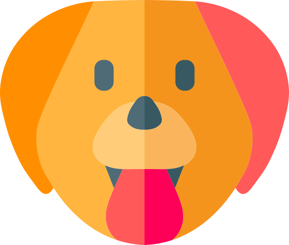

---

layout: col-sidebar
title: OWASP Snow
tags: privacy windows chrome javascript
level: 2
type: code, tool
pitch: Improve privacy of applications by defending shoulder surfing

---

[ OWASP Snow](https://privacysnow.com/)

OWASP Snow is a software-based screen blurring technology. Once activated, it will blur the entire screen so that everything on the screen will become illegible. You can unblur a small portion of the screen by hovering your mouse cursor on items you want to see.

## Contributors

In order of appearance:

* Abhi M Balakrishnan - Author
* Akhi M Balakrishnan - Windows app
* Adarsh Girijan - Logo

## Licensing

OWASP Snow is licensed under the Apache License 2.0

For more details, please visit the official website at https://privacysnow.com/
